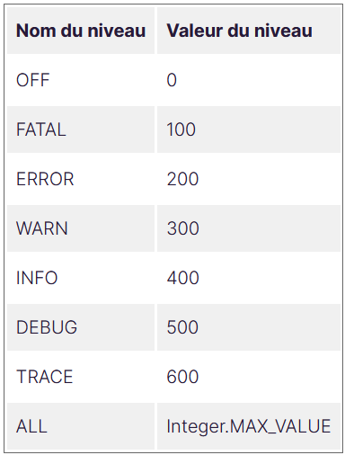

<h1>Une trace ou un log en anglais est une information issue de l’exécution du code de l’application. </h1>

```
Pourquoi vouloir laisser des traces ? Nous accédons au code après tout.
```
C’est vrai, mais il arrive qu’à l'exécution le code se comporte d’une façon que nous n’avions pas imaginé et dans ces
moments savoir plus précisément ce qu’il s’est passé sera salvateur !

Nous avons notre objectif : laisser des traces !

```
Mais où ?
```

Plusieurs possibilités s’offrent à nous. La plus facile est de les laisser dans la console. D’autres sont plus
pertinentes comme, par exemple, les écrire dans un fichier ou encore mieux dans une base de données.

Pour l’instant nous nous contenterons d’écrire dans la console.

```
Quelles traces allons-nous laisser ?
```

Cela dépend des besoins de ceux qui vont les consulter. Si je suis un testeur, comme Juan, je vais surtout être
intéressé par des traces qui concernent les erreurs. Si je suis développeur et que je dois investiguer, j’aimerais
certainement des traces précises concernant le code dysfonctionnel. Si je suis un utilisateur, j’aimerais certainement
ne pas voir de traces !

Autrement dit, nous ne pouvons nous contenter d’une seule approche et il faudra donc une stratégie de logging. Pour
répondre à cette problématique, en Java les bibliothèques de logging offrent des niveaux de logs.

Le concept consiste en l’association d’une trace avec un niveau. Ensuite lors de l’exécution de l’application le niveau
de log à utiliser est défini. Toutes les traces associées à ce niveau et au niveau supérieur sont utilisées.</br></br>

